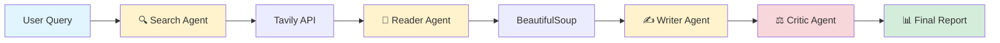
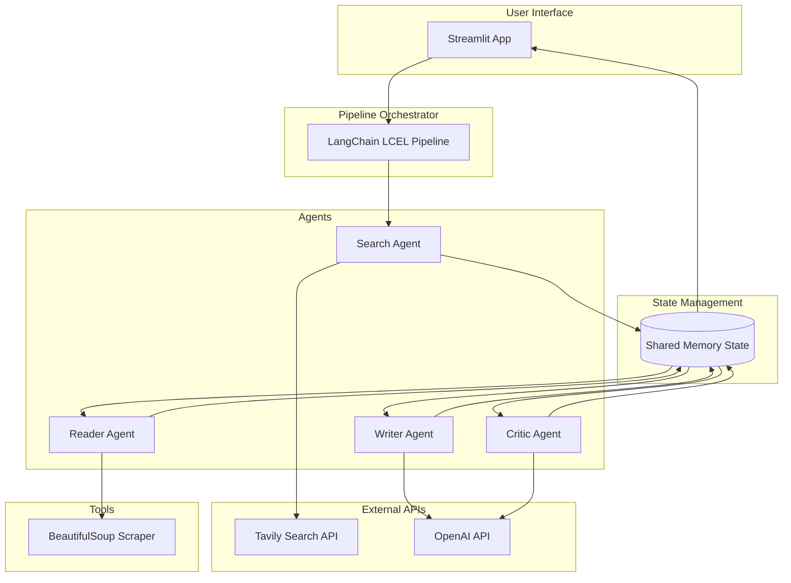

<div align="center">

# 🌊 **CritixOcean**
### *Autonomous Multi-Agent AI Research System*


**A production-grade AI research orchestration system where autonomous agents collaborate to transform queries into publication-ready research reports.**

[🚀 Features](#-features) • [🧠 How It Works](#-how-it-works) • [📦 Installation](#-installation) • [⚡ Quick Start](#-quick-start) • [🏗️ Architecture](#-architecture)

---

</div>

## 🎯 **What is CritixOcean?**

CritixOcean is an **enterprise-grade multi-agent AI system** that mimics a real research team: one agent searches the web, another reads and synthesizes content, a writer drafts comprehensive reports, and a critic ensures quality before delivery.

Unlike traditional single-model approaches, **CritixOcean orchestrates specialized agents** working in harmony through LangChain's LCEL pipeline, with shared memory and intelligent handoffs.

> 💡 **Think of it as**: Your personal AI research lab that operates 24/7 with zero human intervention.

---

## ✨ **Features**

<table>
<tr>
<td>

### 🔍 **Real-Time Web Intelligence**
- Live web search via **Tavily API**
- Dynamic content extraction
- No static/outdated knowledge

</td>
<td>

### 🤖 **Multi-Agent Orchestration**
- **4 specialized AI agents** in pipeline
- Shared memory state across agents
- Autonomous decision-making

</td>
</tr>
<tr>
<td>

### 📝 **Publication-Quality Output**
- Structured research reports
- Markdown formatting
- Citation-ready content

</td>
<td>

### ⚖️ **Built-In Quality Control**
- Dedicated Critic Agent
- Scoring & feedback system
- Iterative refinement capability

</td>
</tr>
<tr>
<td>

### ⚡ **Production-Ready Architecture**
- Modular design pattern
- Environment-based configuration
- Scalable & maintainable codebase

</td>
<td>

### 🎨 **Modern UI**
- Clean Streamlit interface
- Real-time progress tracking
- Interactive report display

</td>
</tr>
</table>

---

## 🧠 **How It Works**

CritixOcean implements a **sequential agent pipeline** where each agent has a specialized role:



### **Agent Breakdown**

| Agent | Role | Technology | Output |
|-------|------|------------|--------|
| 🔍 **Search Agent** | Discovers relevant web sources | Tavily API | List of URLs + Snippets |
| 📖 **Reader Agent** | Extracts & cleans content | BeautifulSoup4 | Structured text data |
| ✍️ **Writer Agent** | Generates research report | OpenAI GPT-4 | Markdown report |
| ⚖️ **Critic Agent** | Reviews & scores quality | OpenAI GPT-4 | Feedback + Score (1-10) |

---

## 🏗️ **Architecture Overview**



---

## ⚙️ **Tech Stack**

<div align="center">

| Category | Technology |
|----------|-----------|
| **Language** |  |
| **AI Framework** |  |
| **LLM Provider** |  |
| **Search Engine** |  |
| **Web Scraping** |  |
| **Frontend** |  |
| **Environment** |  |

</div>

---

## 📂 **Project Structure**

```
CritixOcean/
├── .streamlit/
│   └── config.toml              # Streamlit configuration
├── .devcontainer/
│   └── devcontainer.json        # Dev container setup
├── agents.py                    # Core agent definitions
├── tools.py                     # Tavily & scraping tools
├── pipeline.py                  # LCEL pipeline orchestration
├── app.py                       # Streamlit UI
├── requirements.txt             # Python dependencies
├── .env                         # API keys (not in repo)
└── README.md                    # You are here
```

---

## 🚀 **Getting Started**

### 📦 **Installation**

```bash
# Clone the repository
git clone https://github.com/Chhavi001/CritixOcean.git
cd CritixOcean

# Create virtual environment (recommended)
python -m venv venv
source venv/bin/activate  # On Windows: venv\Scripts\activate

# Install dependencies
pip install -r requirements.txt
```

### 🔑 **Environment Setup**

Create a `.env` file in the root directory:

```env
# OpenAI API Key (required)
OPENAI_API_KEY=sk-your-openai-api-key-here

# Tavily API Key (required)
TAVILY_API_KEY=tvly-your-tavily-api-key-here
```

**Where to get API keys:**
- 🔹 **OpenAI**: [platform.openai.com](https://platform.openai.com/api-keys)
- 🔹 **Tavily**: [tavily.com](https://tavily.com) (Free tier available)

### ▶️ **Run the Application**

```bash
# Start Streamlit app
streamlit run app.py
```

🌐 Open browser at: `http://localhost:8501`

---

## 🔄 **Pipeline Flow Explained**

### **Step 1: Search Phase** 🔍
```python
# User inputs: "Latest advancements in quantum computing"
# Search Agent queries Tavily API
# Returns: Top 5-10 relevant URLs + summaries
```

### **Step 2: Reading Phase** 📖
```python
# Reader Agent visits each URL
# BeautifulSoup extracts main content
# Filters out ads, navigation, footers
# Stores clean text in shared memory
```

### **Step 3: Writing Phase** ✍️
```python
# Writer Agent receives all extracted content
# Uses GPT-4 to synthesize information
# Generates structured report with:
#   - Executive Summary
#   - Key Findings
#   - Detailed Analysis
#   - Conclusions
```

### **Step 4: Critique Phase** ⚖️
```python
# Critic Agent reviews the report
# Evaluates:
#   - Accuracy & completeness
#   - Structure & clarity
#   - Citation quality
# Provides score (1-10) + improvement suggestions
```

---

## 💻 **Usage Example**

```python
from pipeline import research_pipeline

# Simple API
query = "Impact of AI on healthcare industry 2024"
result = research_pipeline.invoke({"query": query})

print(result["report"])        # Final research report
print(result["critic_score"])  # Quality score (1-10)
print(result["feedback"])      # Critic's feedback
```

---


### 🎨 **Streamlit Interface**
*Clean, modern UI for submitting queries and viewing results*

### 📊 **Generated Report**
*Publication-quality research output with structured sections*

### ⚖️ **Critic Feedback**
*Detailed quality assessment and improvement suggestions*

---

## 🎯 **Why This Project Stands Out**

### **For Recruiters & Hiring Managers:**

✅ **Production-Level Architecture**  
   - Not a tutorial project—this uses industry-standard patterns
   - Modular, scalable, and maintainable codebase
   - Proper separation of concerns (agents, tools, pipeline, UI)

✅ **Advanced AI Engineering**  
   - Multi-agent orchestration (not just single LLM calls)
   - State management across agent transitions
   - LCEL pipeline implementation (modern LangChain approach)

✅ **Real-World Problem Solving**  
   - Addresses actual research workflow automation
   - Combines multiple APIs and technologies
   - Handles edge cases (network errors, parsing failures)

✅ **Full-Stack AI Application**  
   - Backend: Python, LangChain, OpenAI
   - Frontend: Streamlit UI
   - DevOps: Environment management, containerization support

✅ **Quality & Best Practices**  
   - Built-in quality control (Critic Agent)
   - Environment-based configuration
   - Clean code structure & documentation

---

## 🔮 **Future Roadmap**

### **Phase 2 Enhancements**
- [ ] **Vector Database Integration** (Pinecone/Weaviate) for semantic search
- [ ] **Parallel Agent Execution** for faster processing
- [ ] **Multi-Language Support** (reports in Spanish, French, etc.)
- [ ] **Citation Tracking** with automatic bibliography generation
- [ ] **Report Export** (PDF, Word, LaTeX formats)

### **Phase 3 - Enterprise Features**
- [ ] **Agent Memory Persistence** (conversation history across sessions)
- [ ] **Custom Agent Configuration** (user-defined agent behaviors)
- [ ] **API Endpoint** (RESTful API for programmatic access)
- [ ] **Monitoring Dashboard** (agent performance metrics)
- [ ] **Multi-Model Support** (Claude, Gemini, Llama)

### **Phase 4 - Advanced Capabilities**
- [ ] **Autonomous Fact-Checking** agent
- [ ] **Visual Content Analysis** (image/chart interpretation)
- [ ] **Interactive Q&A** mode for deep dives
- [ ] **Collaborative Research** (multi-user support)

---

## 🤝 **Contributing**

Contributions are welcome! This project follows standard open-source practices.

```bash
# Fork the repo → Clone → Create branch → Make changes → Submit PR
```

---

## 📄 **License**

This project is licensed under the **MIT License** - see the [LICENSE](LICENSE) file for details.

---

## 👨‍💻 **Author**

**Chhavi**  
🔗 [GitHub](https://github.com/Chhavi001) • 💼 [LinkedIn](https://linkedin.com/in/chhavi001)

> *Built with passion for autonomous AI systems and modern software engineering practices.*

---

<div align="center">

### ⭐ **If you find this project impressive, consider starring the repository!**

**Made with ❤️ and AI • CritixOcean © 2026**

</div>
